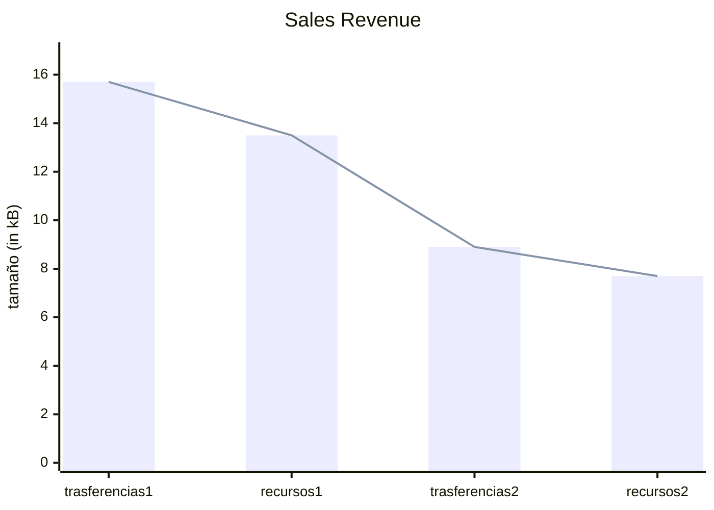
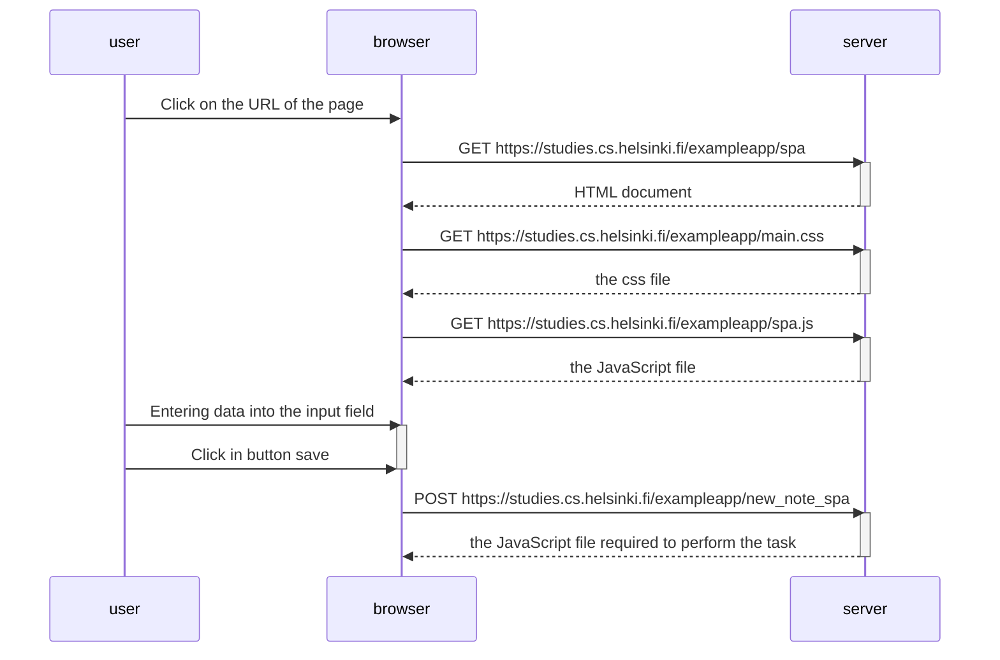

# Sustento del ejercicio 6
En este ultimo ejercicio no solo hare el diagrama de secuencia para la aplicación de una sola pagina, también elaborare una comparativa de nuestra pagina y esta.

### Lógica
Al agregar una nueva nota estamos haciendo que el navegador actué en consecuencia, realizando una solicitud HTTP con el método POST a [https://studies.cs.helsinki.fi/exampleapp/new_note_spa](https://studies.cs.helsinki.fi/exampleapp/new_note_spa) esta solicitud ya contiene la nota como datos JSON, lo que significa que solo necesita la lógica que le brinda el servidor como respuesta. En comparación con nuestra aplicación este "método" simplifica mucho los eventos al agregar notas, en comparación con nuestra aplicación.

### Ventajas
¿Porque es importante esto?, pues al analizar esta aplicación me di cuenta que  no solo mejora la cantidad de eventos sino por consecuencia disminuye los datos trasferidos, los recursos utilizados y el tiempo que se tomo en realizar esto. lo podremos apreciar en las siguientes imágenes y gráficas.

Esta comparativa esta realizada para una nueva solicitud, la primera imagen pertenece a nuestra aplicación y la segunda pertenece ala aplicación de una sola pagina. 

*A continuación se mostrara la gráfica de barras que compara nuestra aplicación(1) con la aplicación de una sola pagina(2)*

*El diagrama de secuencia seria el siguiente:*

